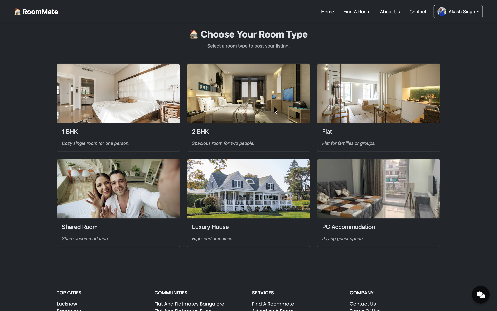
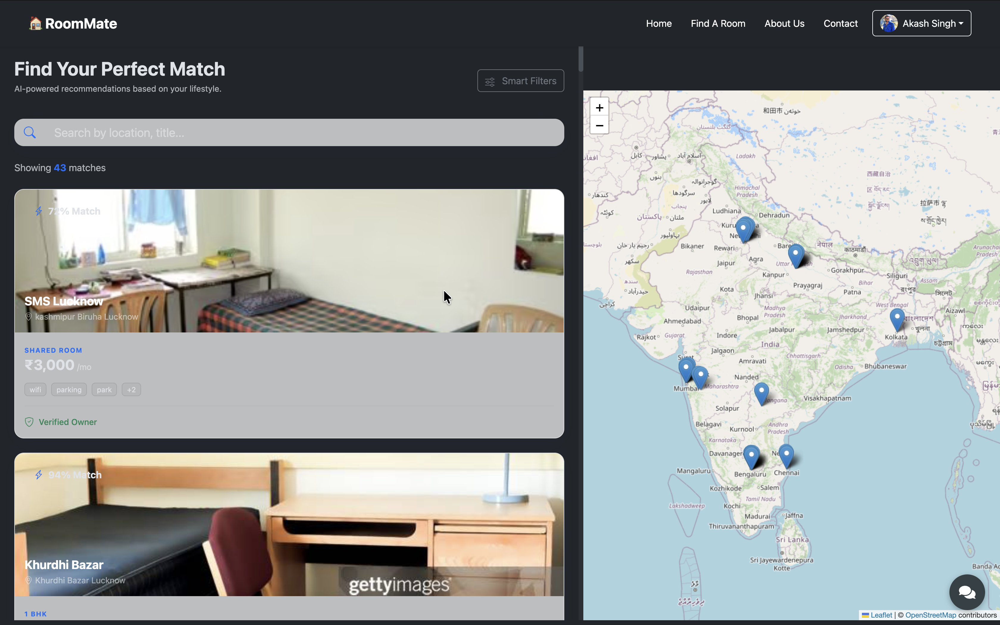
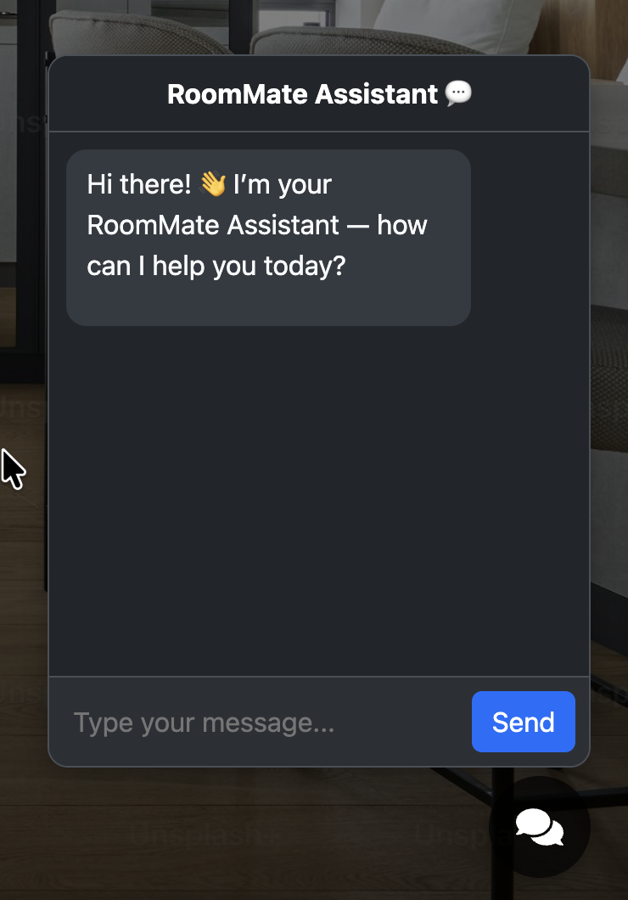
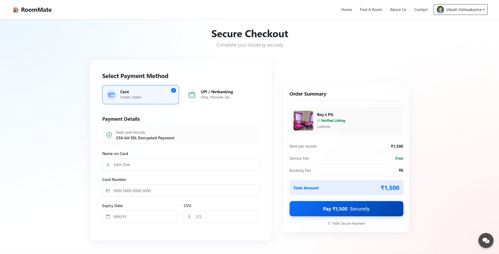
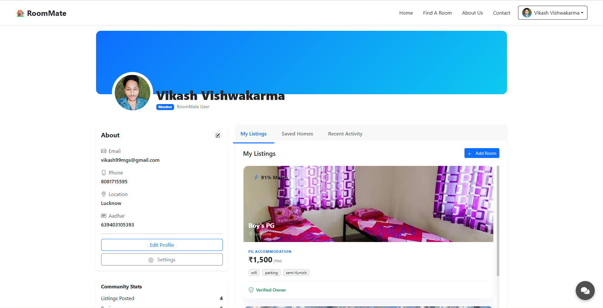
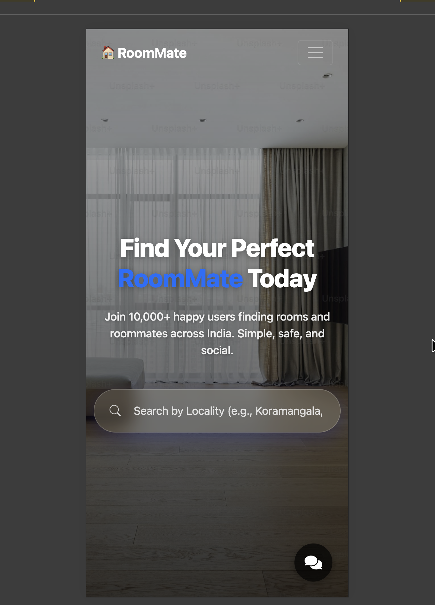
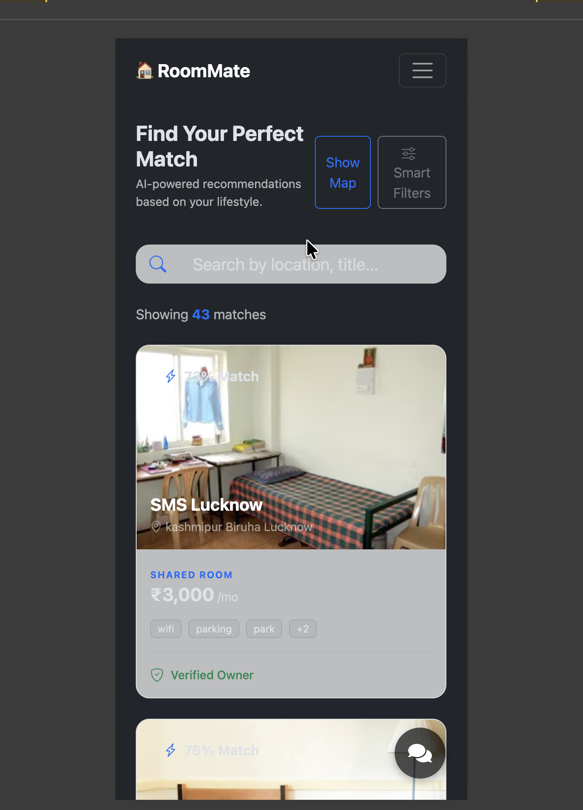
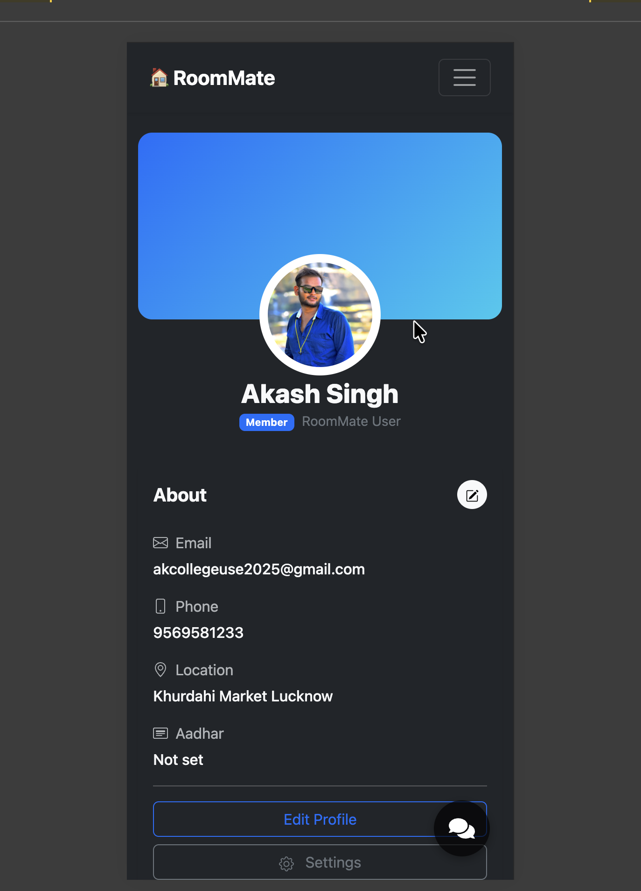

<div align="center">

# 🏠 RoomMate

### Smart Room Rental Platform

[](https://reactjs.org/)
[](https://nodejs.org/)
[](https://expressjs.com/)
[](https://www.mongodb.com/)
[](https://vitejs.dev/)
[](LICENSE)

**A modern, AI-powered platform connecting people with their perfect living spaces**

[Demo](#-demo) • [Features](#-features) • [Screenshots](#-screenshots) • [Installation](#-installation) • [Tech Stack](#-tech-stack) • [Contact](#-contact)

---


</div>

---

## 📖 About

**RoomMate** is a comprehensive full-stack room rental platform designed to simplify the process of finding and listing rental properties. Whether you're searching for a PG, roommate, flatmate, or an entire house, RoomMate provides an intuitive, feature-rich experience powered by modern web technologies and AI.

### 🎯 Problem It Solves

| For Renters | For Property Owners |
|-------------|---------------------|
| ✅ Advanced search with smart filters | ✅ Easy property listing management |
| ✅ Interactive maps for location discovery | ✅ Direct connection with tenants |
| ✅ AI-powered recommendations | ✅ Booking & tour scheduling |
| ✅ Transparent pricing & rent prediction | ✅ Secure payment processing |

---

## ✨ Features

<table>
<tr>
<td width="50%">

### 🔍 Smart Search & Discovery
- Advanced multi-filter search
- Category browsing (PG, Coliving, Flatmate, Room, House)
- Real-time search results
- Interactive Leaflet maps
- Locality dashboard with insights

</td>
<td width="50%">

### 🤖 AI-Powered Assistant
- Intelligent chatbot (Google Gemini)
- Rent prediction tool
- Smart property recommendations
- Natural language queries
- 24/7 instant support

</td>
</tr>
<tr>
<td width="50%">

### 👤 User Management
- JWT-based authentication
- Role-based access (User/Member/Admin)
- Profile customization with avatar
- Favorites & saved listings
- Booking history

</td>
<td width="50%">

### 🎨 Modern UI/UX
- Responsive design (Mobile-first)
- Dark/Light theme toggle
- Glassmorphism aesthetics
- Smooth animations
- Accessibility focused

</td>
</tr>
<tr>
<td width="50%">

### 💳 Payments & Booking
- Secure payment gateway
- Tour scheduling system
- Email confirmations
- Transaction history
- Booking management

</td>
<td width="50%">

### 📊 Admin Dashboard
- User & listing management
- Analytics & statistics
- Content moderation
- Communication inbox
- Approval workflows

</td>
</tr>
</table>

---

## 📸 Screenshots

<div align="center">

### 🏠 Homepage
*Modern landing page with hero section, featured listings, and community stats*


---

### 🔍 Find A Room
*Browse listings with advanced filters, sorting, and map view*



---

### 📋 Listing Details
*Detailed property view with gallery, amenities, map, and booking options*



---

### 🤖 AI Chatbot
*Get instant help with property searches through our AI assistant*



---

### 💳 Payment & Booking
*Secure checkout with booking summary and payment processing*



---

### 👤 User Profile
*Manage profile, listings, bookings, and account settings*



---

### 📞 Contact Us
*Get in touch with our team through a beautiful contact form*


---

### 📱 Mobile Responsive
*Fully optimized for all screen sizes*

<p>



</p>

</div>

---

## 🛠 Tech Stack

<table align="center">
<tr>
<td align="center" width="33%">

### Frontend


</td>
<td align="center" width="33%">

### Backend


</td>
<td align="center" width="33%">

### AI & Tools


</td>
</tr>
</table>

---

## 🚀 Installation

### Prerequisites

- **Node.js** v18+ 
- **MongoDB** (local or [Atlas](https://www.mongodb.com/atlas))
- **Google Gemini API Key** ([Get one here](https://makersuite.google.com/app/apikey))

### Quick Start

```bash
# Clone the repository
git clone https://github.com/akash9569/RoomMate.git
cd RoomMate
```

#### Backend Setup

```bash
cd server
npm install

# Create .env file
cat > .env << EOF
MONGO_URI=mongodb://127.0.0.1:27017/roommate
JWT_SECRET=your_super_secret_jwt_key_here
GOOGLE_API_KEY=your_google_gemini_api_key
PORT=3000
NODEMAILER_USER=your_email@gmail.com
NODEMAILER_PASS=your_app_password
EOF

# Start server
npm run dev
```

#### Frontend Setup

```bash
cd client
npm install

# Start development server
npm run dev
```

#### Seed Database (Optional)

```bash
cd server
node seedListings.js
```

### Access the Application

| Service | URL |
|---------|-----|
| Frontend | http://localhost:5173 |
| Backend API | http://localhost:3000 |

---

## 📁 Project Structure

```
RoomMate/
│
├── 📂 client/                    # React Frontend
│   ├── 📂 src/
│   │   ├── 📂 components/        # Reusable UI components
│   │   │   ├── NavbarComponent.jsx
│   │   │   ├── Footer.jsx
│   │   │   ├── Chatbot.jsx
│   │   │   ├── ListingCard.jsx
│   │   │   └── ...
│   │   ├── 📂 pages/             # Page components
│   │   │   ├── AllListingPage.jsx
│   │   │   ├── ListingDetailsPage.jsx
│   │   │   ├── ProfilePage.jsx
│   │   │   └── ...
│   │   ├── 📂 context/           # React Context providers
│   │   │   ├── AuthContext.jsx
│   │   │   └── ThemeContext.jsx
│   │   └── 📂 utils/             # Utility functions
│   └── 📂 public/                # Static assets
│
├── 📂 server/                    # Express Backend
│   ├── 📂 config/
│   │   └── db.js                 # MongoDB connection
│   ├── 📂 models/
│   │   ├── User.js               # User schema
│   │   └── Listing.js            # Listing schema
│   ├── 📂 routes/
│   │   ├── auth.js               # Authentication routes
│   │   ├── listings.js           # Listing CRUD routes
│   │   ├── chatbot.js            # AI chatbot route
│   │   └── ...
│   └── 📂 uploads/               # User uploaded files
│
└── 📂 images/                    # README assets
    └── 📂 screenshots/           # App screenshots
```

---

## 🔐 Environment Variables

<details>
<summary><b>Backend (.env)</b></summary>

```env
# MongoDB Connection
MONGO_URI=mongodb://127.0.0.1:27017/roommate

# JWT Configuration
JWT_SECRET=your_super_secret_jwt_key_here

# Google Gemini AI
GOOGLE_API_KEY=your_google_gemini_api_key

# Server Port
PORT=3000

# Email Configuration (Nodemailer)
NODEMAILER_USER=your_email@gmail.com
NODEMAILER_PASS=your_app_password
```

</details>

---

## 🛣 Roadmap

- [x] Core listing functionality
- [x] User authentication & profiles
- [x] AI chatbot integration
- [x] Map-based search
- [x] Dark/Light theme
- [x] Real-time notifications (WebSocket)
- [x] Mobile app (React Native)
- [x] Multi-language support
- [x] Advanced analytics dashboard
- [x] Review & rating system

---

## 🤝 Contributing

Contributions are what make the open-source community amazing! Any contributions you make are **greatly appreciated**.

1. Fork the Project
2. Create your Feature Branch (`git checkout -b feature/AmazingFeature`)
3. Commit your Changes (`git commit -m 'Add some AmazingFeature'`)
4. Push to the Branch (`git push origin feature/AmazingFeature`)
5. Open a Pull Request

---

## 📄 License

Distributed under the **MIT License**. See `LICENSE` for more information.

---

## 📬 Contact

<div align="center">

### Akash Singh

[](https://akashsingh.dev)
[](https://www.linkedin.com/in/iamakashsingh9)
[](https://github.com/akash9569)
[](mailto:akashsingh.internship@gmail.com)

</div>

---

## 🙏 Acknowledgments

<div align="center">

| | | |
|:-:|:-:|:-:|
| [React](https://reactjs.org/) | [MongoDB](https://www.mongodb.com/) | [Google Gemini](https://deepmind.google/technologies/gemini/) |
| [Leaflet](https://leafletjs.com/) | [Bootstrap](https://getbootstrap.com/) | [Express.js](https://expressjs.com/) |

</div>

---

<div align="center">

### ⭐ Star this repo if you find it helpful!

<br />

**Made with ❤️ by [Akash Singh](https://github.com/akash9569)**

<br />


</div>
